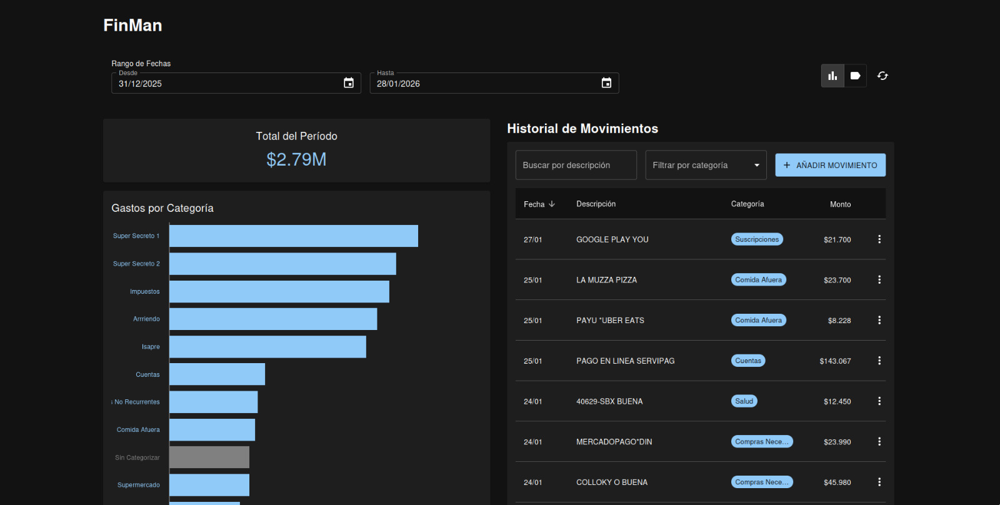
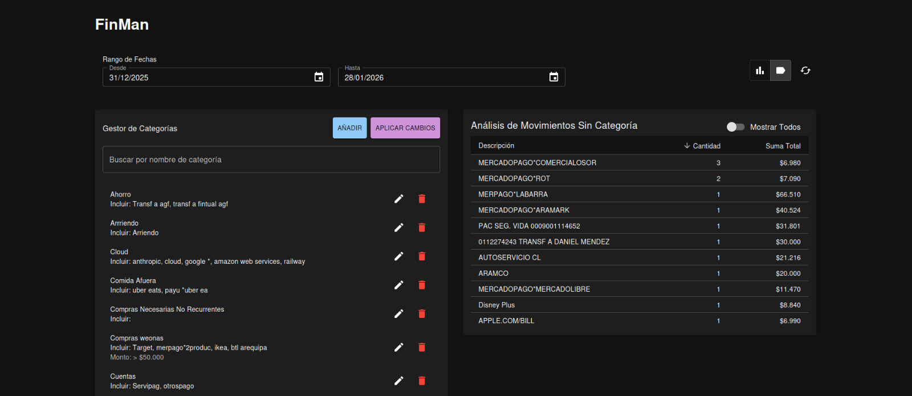
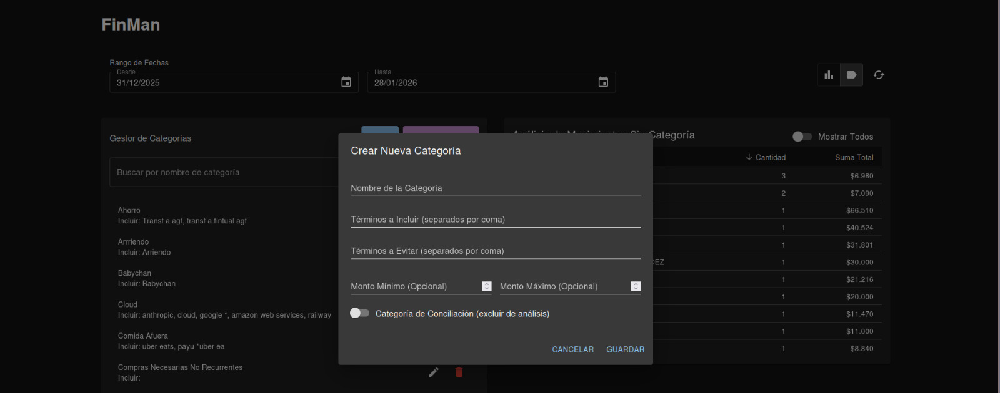

# FinMan

Another Finance App made with Vibe-Coding (But works with Santander)

> [Leer esto en Español](README.md) 🇨🇱

**FinMan** is a financial manager that synchronizes with your bank and helps you categorize and measure your expenses in real-time.

---

## 📖 Usage Instructions

Once the application is running (see Installation section below), here is what you can do:

### 1. 🏠 The Dashboard
Accessing `http://localhost:3000` will show you the summary of your current month:
- **Total Spend:** How much you have spent in the current month.
- **Bar Chart:** Visual distribution of your expenses by category (Food, Transport, Home, etc.).
- **History:** A table with synchronized movements, sorted by date. Manual categorization can also be done here.
- **Historical Chart:** A line chart showing expenses across different months. Profilable by expense types.



### 2. 🔄 Sync with Bank
In the top right corner, you will find the **"Sync"** button.
- When pressed, FinMan will use your credentials (securely saved on your own computer) to fetch new movements.
- **Note:** This may take a few seconds depending on the bank's challenges.

### 3. 🏷️ Categorize Expenses
The most important part. FinMan tries to guess what each expense is, but you have the final word:
- **Configurable Categories:** You can configure categories with keywords, exclusions, and minimum/maximum amounts. Categories are automatically applied to scraped movements.



- **Apply Categories:** To apply changes to categories, just hit the "Apply" button. It allows you to decide whether to apply only to uncategorized movements, to all those automatically categorized, or to all movements (including manually categorized ones).
- **Change a category manually:** Click the three dots in the history table to manually change the category of a movement. (This takes precedence over automatic categories).
- **Uncategorized movements summary:** A summary table of uncategorized movements, grouped by their description, with occurrence count and total sum. Useful to know what is missing categorization.



---

## 🚀 Installation and Setup

To use FinMan on your computer, you need to install it. If these words sound like Greek to you (*Docker, Terminal*), ask your trusted tech friend for help or follow these steps carefully.

### Prerequisites
- Have **Docker Desktop** installed (it's the engine that runs the app).

### Step by Step (The Easy Way)

1.  **Initial Configuration:**
    Open your terminal in the project folder and type:
    ```bash
    make setup
    ```
    *This will create a `.env` file. Open it with Notepad and enter your RUT and Bank Password where indicated.*

2.  **Start the Application:**
    Type:
    ```bash
    make start
    ```
    *Wait a few moments. When finished, open your web browser and go to `http://localhost:3000`.*

3.  **Stop the Application:**
    When you are done using it:
    ```bash
    make stop
    ```

---

## ⚙️ Technical Information (For Developers)


This section is for those who want to modify the code or understand how it works internally.

### Architecture
The project is a **Virtual Monorepo** consisting of:
- **Frontend (`/frontend`):** Built with Next.js. It is the interface the user sees.
- **Scraper (`/scraper`):** An isolated service with Playwright that navigates the bank site.
- **Database:** MongoDB running in Docker.

### Advanced Commands (Makefile)

| Command | Description |
| :--- | :--- |
| `make logs` | Shows what is happening in the app and scraper (without database noise). |
| `make dev` | Starts development mode (requires Node.js installed locally). |
| `make build` | Rebuilds Docker images (useful if you modify code). |
| `make clean` | Deletes everything (containers and database data) to start from scratch. |

### Manual Configuration (Without Make)
If you don't have `make` installed, you can use Docker directly:

```bash
# Start
docker compose up -d

# View logs
docker compose logs -f frontend scraper
```